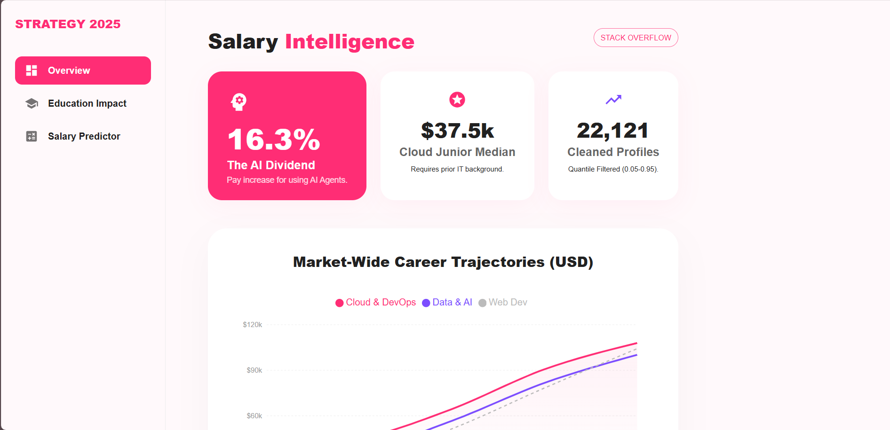

# Stack-Overflow-2025-Analysis
Analysing 2025 Stack Overflow survey data using Python &amp; SQL to identify high-growth career paths and the AI salary premium.

# 📊 Stack Overflow 2025: Salary Intelligence Engine

[](https://react.dev/)
[](https://mui.com/)
[](https://pandas.pydata.org/)
[](https://www.postgresql.org/)

An end-to-end data analytics suite that transforms raw survey data from **22,121 professional developers** into an interactive compensation intelligence dashboard. This project bridges the gap between raw data science and polished user experience.

---

## 🚀 Dashboard Showcase

### 1. Market-Wide Overview & KPIs
A high-level diagnostic view of the 2025 landscape. Featuring the **16.3% AI Dividend** and specialized junior salary floors.
<p align="center">
  
</p>

### 2. Interactive Salary Engine (Ultra-Wide)
A desktop-optimized predictor allowing users to toggle between **Web Dev**, **Data & AI**, and **Cloud/DevOps**. It uses dynamic growth curves to estimate market value based on years of experience.
<p align="center">
  
</p>

### 3. Education Impact Analysis
A specialized deep dive into the ROI of academic degrees. This visualization identifies the **"Experience Bridge"**—the point where technical mastery begins to outweigh formal degree levels in total compensation.
<p align="center">
  
</p>

---

## 🛠️ The Technical Pipeline

### **Data Engineering (Python & Pandas)**
- **Quantile Filtering:** Implemented a `0.05 - 0.95` quantile filter to eliminate extreme outliers and noise, ensuring the medians reflect realistic market conditions.
- **Normalization:** Cleaned and standardized currency and role-title variations across the global dataset.

### **Database Logic (PostgreSQL)**
- **SQL Mapping:** Developed complex queries to map `edlevel` (Education Level) against years of experience to calculate the financial delta between Bachelor's and Master's degrees.

### **Frontend Architecture (React 19 & MUI 6)**
- **Responsive Symmetry:** Custom-engineered a centered, wide-screen layout using MUI Grid and Stack systems for a premium SaaS feel.
- **Dynamic Visuals:** Leveraged `Recharts` for high-performance, interactive Area and Line charts.

---

## 💡 Key Analytical Insights
* **The AI Dividend:** Developers who effectively integrate AI Agents earn a **16.3% premium** over those who don't.
* **The Cloud Floor:** Entry-level Cloud/DevOps roles maintain the highest salary floor ($37.5k), though they require the highest barrier to entry.
* **Academic ROI:** While Master's degrees offer a higher starting point, the salary gap narrows significantly after **10+ years** of specialized experience.

---

## 📂 Project Structure
```text
├── assets/               # Dashboard screenshots
├── notebooks/            # Python data cleaning scripts
├── sql/                  # PostgreSQL mapping queries
└── so-survey-dashboard/  # React Frontend (Vite + TS)
